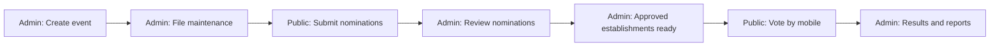
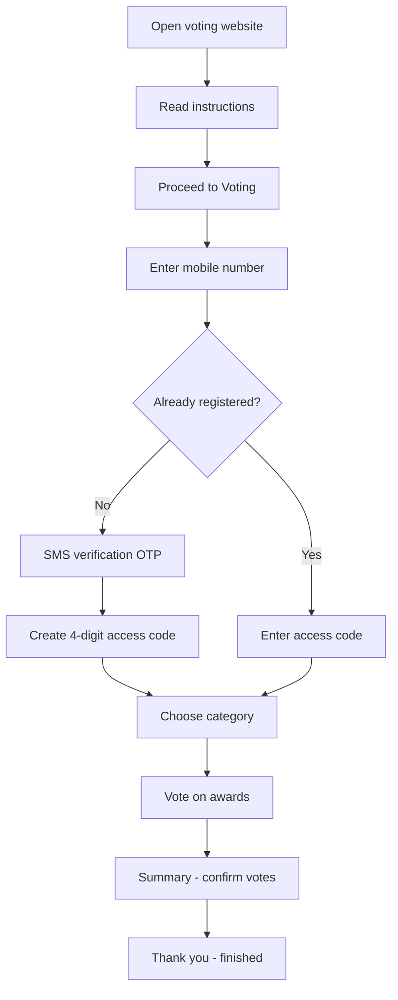

# TOCCA User Manual

**Tatak Ormoc Consumers’ Choice Awards (TOCCA)** — guide for staff and the public

This manual is written for people who are **not technical**. It explains where to click, what each screen is for, and the order of tasks during an awards cycle.

---

## Table of contents

1. [What this system does](#1-what-this-system-does)
2. [Three websites in one system](#2-three-websites-in-one-system)
3. [How an awards year flows](#3-how-an-awards-year-flows)
4. [Administrator guide](#4-administrator-guide)
5. [Nomination guide (businesses)](#5-nomination-guide-businesses)
6. [Voting guide (public voters)](#6-voting-guide-public-voters)
7. [Common problems and fixes](#7-common-problems-and-fixes)
8. [Glossary](#8-glossary)

---

## 1. What this system does

TOCCA supports the full **Consumers’ Choice Awards** cycle:

| Phase | Who participates | What happens |
|--------|------------------|--------------|
| **Setup** | Admin staff | Create the event, categories, awards, and establishments |
| **Nomination** | Businesses / establishments | Apply online for awards |
| **Review** | Admin staff | Approve or reject nominations; approved entries become voting choices |
| **Voting** | Public voters | Vote by mobile phone during the voting period |
| **Reports** | Admin staff | View voters, results, and export data |

Everything is tied to one **active event** at a time (shown in the left sidebar of the admin panel).

---

## 2. Three websites in one system

Your IT contact will give you the exact web addresses. They usually look like this on a local server:

| Portal | Typical path | Who uses it |
|--------|--------------|-------------|
| **Admin panel** | `…/tocca_admin/` | Organizers and reviewers |
| **Nomination form** | `…/nomination/nomination_form.php` | Businesses applying for awards |
| **Voting site** | `…/e-vote-final-enhanced/` | Public voters |

**Tip:** Bookmark all three links. Share only the **nomination** and **voting** links with the public—not the admin link.

### Using admin and voting in the same browser

The admin site and the voting site use **different login cookies**. If you test voting after using the admin panel, you may need to **refresh the voting page** or sign in again with your mobile number and access code.

---

## 3. How an awards year flows



**Order of work for staff**

1. **Events** — Create the year’s event and set nomination and voting dates.
2. **File Maintenance** — Add categories, award names, establishment types, and establishments (or import from Excel).
3. **Nomination period** — Share the nomination link; monitor **Dashboard** and **Nominations**.
4. **After nomination ends** — Finish reviews; use **Awards Validation** if you need an audit trail.
5. **Before voting** — Confirm establishments appear under **Establishments**; customize **Voter Portal** text if needed.
6. **Voting period** — Share the voting link and optional QR emails; watch **Voters** and **Results**.
7. **After voting** — Export reports; **Archive** the event when done.

The **Dashboard** shows the current phase (nomination vs voting), dates, and countdown.

---

## 4. Administrator guide

### 4.1 Signing in

1. Open the **admin panel** URL (ends with `tocca_admin/`).
2. Enter your **username** and **password** (provided by your administrator).
3. Click **Login**.

**If login fails**

- After **3 wrong passwords**, login is locked for about **5 minutes**. Wait, then try again.
- Usernames and passwords are case-sensitive.

**Signing out**

- Use your account menu (top right) → **Logout**.

---

### 4.2 Finding your way (left sidebar)

The **left menu** is your main map. Tap a section name to expand sub-menus (File Maintenance, Transactions, etc.).

At the top of the sidebar you will see:

- **Active event** — The event that all admin pages use right now.
- If it says **No active event**, go to **File Maintenance → Events** and activate one.

```
┌─────────────────────────────────────┐
│  [Logo]                             │
│  Active event: TOCCA 2026           │
├─────────────────────────────────────┤
│  Dashboard                          │
│  Nominations                        │
│  ▼ File Maintenance                 │
│      Events                         │
│      Categories                     │
│      Name of Awards                 │
│      Establishment Types            │
│      Establishments                 │
│      Nomination Form                │
│  ▼ Transactions                     │
│      Awards Validation              │
│      Nomination Emails              │
│      QR Emails                      │
│  ▼ Feedbacks                        │
│      Nomination                     │
│      Voting                         │
│  ▼ Reports                          │
│      Nomination                     │
│      Voters                         │
│      Results                        │
│  ▼ Utilities                        │
│      System Utilities               │
│      Archives                       │
│      Audit Logs                     │
│  ▼ Customizations                   │
│      Admin Settings                 │
│      Voter Portal                   │
│      Nomination Settings            │
│  ▼ User Portal                      │
│      Mobile Live Preview            │
│      Open Nomination Page           │
│      Open Voter Page                │
└─────────────────────────────────────┘
```

**Breadcrumbs** (under the page title) show where you are, for example:  
`Dashboard › File Maintenance › Events`

---

### 4.3 Dashboard

**Menu:** Dashboard (first item)

**Use it to:**

- See **nomination** and **voting** date ranges for the active event.
- See **status** (which phase is running) and **time remaining**.
- View summary numbers (nominations, voters, etc.) when a period is active.

Start each workday here to confirm the system is on the correct event and schedule.

---

### 4.4 Nominations (reviewing applications)

**Menu:** Nominations

**Use it to:**

- List all nomination applications for the active event.
- Filter by **status** (Pending, In Review, Needs Information, Approved, Rejected, Merged).
- Open a nomination to view details and take action.

**Typical statuses**

| Status | Meaning |
|--------|---------|
| **Pending** | New submission; not yet reviewed |
| **In Review** | Someone is working on it |
| **Needs Information** | Applicant must fix or add something |
| **Approved** | Accepted; can become a voting establishment |
| **Rejected** | Not accepted |
| **Merged** | Combined with an existing establishment record |

**Important:** When the **voting period has started**, nomination management may be **locked** to protect live voting data. Plan to finish reviews before voting opens.

**Actions you may see**

- **Approve** — Accept the nomination (may create or link an **Establishment**).
- **Reject** — Decline with an optional note.
- **Needs information** — Ask the applicant to update their submission.
- **Merge** — Link to an existing establishment ID if the business was nominated twice.

Applicants can check status using **Track Nomination** on the public nomination site (reference number).

---

### 4.5 File Maintenance

Use these pages **before** opening nomination or voting to the public.

#### Events

**Menu:** File Maintenance → **Events**

- **Add Event** — Name, description, nomination start/end, voting start/end.
- **Active** switch — Only one event should be **active** for day-to-day work.
- **Edit** — Change dates or details (careful during live periods).
- **Archive** — Move old years out of the active list (Utilities → Archives).

Always set realistic **nomination** and **voting** windows. The public sites automatically show “closed” messages outside those times.

#### Categories

**Menu:** File Maintenance → **Categories**

Award **groups** (for example: Food & Beverage, Services). Voters pick a category before voting on awards inside it.

#### Name of Awards

**Menu:** File Maintenance → **Name of Awards**

Individual **award titles** under each category (the actual questions voters answer).

#### Establishment Types

**Menu:** File Maintenance → **Establishment Types**

Types of businesses (restaurant, salon, etc.) linked to categories/awards for nominations and voting rules.

#### Establishments

**Menu:** File Maintenance → **Establishments**

The **choices** voters can pick—usually created from **approved** nominations or added manually.

#### Nomination Form

**Menu:** File Maintenance → **Nomination Form**

Configure the fields businesses see on the public nomination form (labels, required fields, uploads).

---

### 4.6 Bulk import (Excel)

**Menu:** Utilities → **System Utilities** → Import Data

**Use when:** You have many categories, awards, types, and establishments to load at once.

1. Download the Excel **template** from the same page.
2. Read the **Instructions** sheet inside the file.
3. Fill in: Categories, Awards, Establishment Types, Establishments.
4. Upload the file — data imports into the **currently active event** only.

After import, spot-check **Categories**, **Name of Awards**, and **Establishments**.

---

### 4.7 Transactions

#### Awards Validation

**Menu:** Transactions → **Awards Validation**

A **read-only log** of changes to award selections on nominations (who changed what and when). Use for audits—not for day-to-day approval (use **Nominations** for that).

#### Nomination Emails

**Menu:** Transactions → **Nomination Emails**

View and manage email notifications related to nominations (status updates, etc.). Filter by date and status as needed.

#### QR Emails

**Menu:** Transactions → **QR Emails**

Send or track emails that include **QR codes** so voters can open a specific category quickly. Use during the voting campaign.

---

### 4.8 Feedbacks

**Menu:** Feedbacks → **Nomination** or **Voting**

Read comments submitted by applicants or voters after they finish forms. Use this to improve instructions or fix confusing steps.

---

### 4.9 Reports

| Page | Purpose |
|------|---------|
| **Nomination** | Summaries and exports for nomination data |
| **Voters** | Who registered, who voted, reminders |
| **Results** | Vote counts and outcome views for the active event |

Export options depend on your setup; use the buttons on each report page.

---

### 4.10 Utilities

| Page | Purpose |
|------|---------|
| **System Utilities** | Import/export tools, maintenance tasks |
| **Archives** | View or restore archived events |
| **Audit Logs** | History of important admin actions |

---

### 4.11 Customizations

| Page | Purpose |
|------|---------|
| **Admin Settings** | Logo, theme, general admin options |
| **Voter Portal** | Wording on the voting home page (title, steps, footer note) |
| **Nomination Settings** | Banner, colors, intro text, instructions for nominators |

**Preview voting changes:** User Portal → **Mobile Live Preview** (or open **Open Voter Page** while logged in as admin with preview).

---

### 4.12 User Portal (quick links)

**Menu:** User Portal

| Link | Purpose |
|------|---------|
| **Mobile Live Preview** | See the voter site as it will look on a phone |
| **Open Nomination Page** | Opens the public nomination form in a new tab |
| **Open Voter Page** | Opens the public voting home page in a new tab |

Use these to test before sharing links on social media or print materials.

---

### 4.13 Recommended admin checklist

**Before nomination opens**

- [ ] Active event set with correct nomination dates  
- [ ] Categories, awards, types configured  
- [ ] Nomination form fields reviewed  
- [ ] Nomination Settings (banner, instructions) updated  
- [ ] Nomination link tested end-to-end  

**During nomination**

- [ ] Dashboard monitored daily  
- [ ] Nominations queue reviewed; statuses updated  
- [ ] Nomination emails sending correctly  

**Before voting opens**

- [ ] All intended establishments approved and visible  
- [ ] Voter Portal text and steps updated  
- [ ] Voting dates confirmed on Events  
- [ ] QR materials prepared if used  

**During voting**

- [ ] Voting link and QR codes published  
- [ ] Voters report monitored  
- [ ] Results checked for anomalies  

**After voting**

- [ ] Final results exported  
- [ ] Event archived when the year is complete  

---

## 5. Nomination guide (businesses)

**Who:** Business owners, managers, or authorized representatives applying for TOCCA awards.

**Where:** Nomination form URL (`nomination/nomination_form.php`)

### 5.1 Before you start

- Confirm the **Nomination Period** shown at the top of the page. You cannot submit outside this window.
- Prepare: business details, contact information, permit numbers, logo/images, and which awards you want.
- Open **“Before you start”** / instructions on the page if your organizer provided them.

### 5.2 Progress steps on the form

The top **stepper** shows three steps:

| Step | Name | What you do |
|------|------|-------------|
| **1** | Business Details | Fill in company information and required fields |
| **2** | Awards | Select which award(s) you are applying for |
| **3** | Review & Submit | Check everything, then submit |

Use **Next** and **Back** to move between steps. Required fields are marked; fix any red errors before continuing.

### 5.3 After you submit

- You should see a **thank you** page with a **reference number**. **Save this number.**
- Use **Track Nomination** (link on the form header) to check status later.
- Enter your **reference number** on the tracking page to see updates (Pending, Approved, etc.).

### 5.4 If the organizer asks for more information

- Status may show **Needs Information**.
- Follow instructions in any email you receive, or contact the TOCCA secretariat.
- You may need to submit a new application or contact support depending on organizer policy.

### 5.5 If the form will not open

- The nomination period may be **closed**—check the dates on the message page.
- Try another browser or phone; use a stable internet connection.
- Contact TOCCA support with a screenshot of the message.

---

## 6. Voting guide (public voters)

**Who:** Eligible voters (usually one vote per mobile number per event).

**Where:** Voting site URL (`e-vote-final-enhanced/`)

### 6.1 When you can vote

Voting is only available between the **voting start** and **voting end** dates set by the organizers. Outside that window you will see a closed message.

### 6.2 Overview of the process



On the ballot you will see three steps at the top:

1. **Categories** — Pick a group of awards  
2. **Vote** — Answer each award in that category  
3. **Summary** — Review and submit your final choices  

You may switch categories and come back until you **finish all awards** and submit.

### 6.3 Step-by-step: first-time voter

1. Open the voting link on your **phone** (recommended) or computer.
2. Read the welcome text and numbered instructions on the home page.
3. Accept **Terms and Conditions** and **Privacy Policy** when prompted.
4. Click **Proceed to Voting**.
5. Enter your **mobile number** (Philippines format as shown on screen).
6. Complete **SMS verification** (one-time code). This proves the number is yours.
7. Create a **4-digit access code** — choose something you will remember but others cannot guess. **Write it down** in a safe place.
8. You will reach **Categories** — tap a category to start voting.
9. For each award, select your choice (and confirm if asked).
10. When done with a category, return to **Categories** or go to **Summary**.
11. On **Summary**, review each award. Use **Vote All** only when every award you intend to vote for is filled in correctly.
12. After successful submission, you will see a **thank you** page. **You cannot vote again** with the same mobile number for this event.

### 6.4 Step-by-step: returning voter (not finished)

Use this if you started voting but did not complete every award.

1. Open the voting site → **Proceed to Voting**.
2. Enter the **same mobile number**.
3. Enter your **4-digit access code** (not the SMS OTP).
4. Continue from **Categories** or **Summary** where you left off.

Your progress is saved on the server until the voting period ends or you fully submit.

### 6.5 Forgot access code

1. On the access code screen, choose **Forgot access code?** (or similar link).
2. Verify your mobile number again with **SMS OTP**.
3. Set a **new 4-digit access code**.

You cannot reset the code if you have **already fully submitted** your ballot.

### 6.6 QR code voting

Some campaigns give a **QR code** for a specific category.

1. Scan the QR code with your phone camera.
2. Follow the same login steps (mobile + access code or new registration).
3. You may land directly in that category after sign-in.

QR codes do **not** skip identity checks—you still need your mobile number and access code.

### 6.7 Rules to remember

| Rule | Explanation |
|------|-------------|
| **One completed ballot per mobile** | After you submit all awards, the same number cannot vote again |
| **Access code is private** | Do not share your 4-digit code |
| **Finish all awards** | You are only “done” when every award for the event is voted and submitted |
| **Draft saves** | You can pause and return before final submission |
| **Wrong code lockout** | After several wrong access code tries, wait about 5 minutes |

### 6.8 Signing out

On category or summary pages, use **Sign out** if you are on a shared device after saving your progress—or after you are completely finished.

---

## 7. Common problems and fixes

### Admin

| Problem | What to try |
|---------|-------------|
| “No active event” on sidebar | File Maintenance → Events → set one event **Active** |
| Public site says closed but dates look correct | Check **Asia/Manila** time on server; confirm nomination vs voting dates on Events |
| Cannot change nominations | Voting may have started; finish changes before voting opens |
| Import failed | Re-read Excel **Instructions** sheet; confirm correct active event |
| Locked out of admin login | Wait 5 minutes after failed attempts |

### Nomination

| Problem | What to try |
|---------|-------------|
| Form not available | Check nomination period dates |
| Upload fails | Smaller file size; use JPG/PNG; stable connection |
| Lost reference number | Contact secretariat with business name and mobile used |

### Voting

| Problem | What to try |
|---------|-------------|
| SMS code not received | Check signal; wait 60 seconds before resend; correct mobile format |
| “Already voted” | That number completed a ballot; one vote per mobile per event |
| “Voting closed” | Outside voting dates |
| Access code not accepted | Caps doesn’t apply (digits only); use Forgot flow after lockout wait |
| Stuck after using admin site | Refresh voter page; log in again with mobile + access code |
| Page blank or errors | Try Chrome/Safari; clear cache; different network |

**When to call technical support:** Provide the exact message on screen, your mobile number (for voting issues), nomination reference (for applicants), and the date/time of the problem.

---

## 8. Glossary

| Term | Plain meaning |
|------|----------------|
| **Event** | One awards year (e.g. TOCCA 2026) with its own dates and data |
| **Active event** | The one event the admin system is working on now |
| **Category** | A group of related awards (voters pick this first) |
| **Award / Name of Award** | A single title voters decide (e.g. “Best Café”) |
| **Establishment** | A business listed as a voting choice |
| **Nomination** | A business application before approval |
| **Access code** | Your private 4-digit PIN to resume voting |
| **OTP** | One-time SMS code to verify your phone |
| **Draft** | Saved but not final voting progress |
| **Finalize / Submit** | Lock in your vote for an award or the whole ballot |
| **QR vote** | Starting voting from a printed or digital QR code |

---

## Document information

| Item | Detail |
|------|--------|
| **System** | TOCCA — Tatak Ormoc Consumers’ Choice Awards |
| **Audience** | Admin staff, nominators, voters |
| **Technical reference** | Staff with IT access may also read `e-vote-final-enhanced/docs/VOTER_FLOW.md` and `SECURITY.md` |

*Replace `[Your site address]` in shared links with the real URL from your hosting provider before distributing this manual.*
