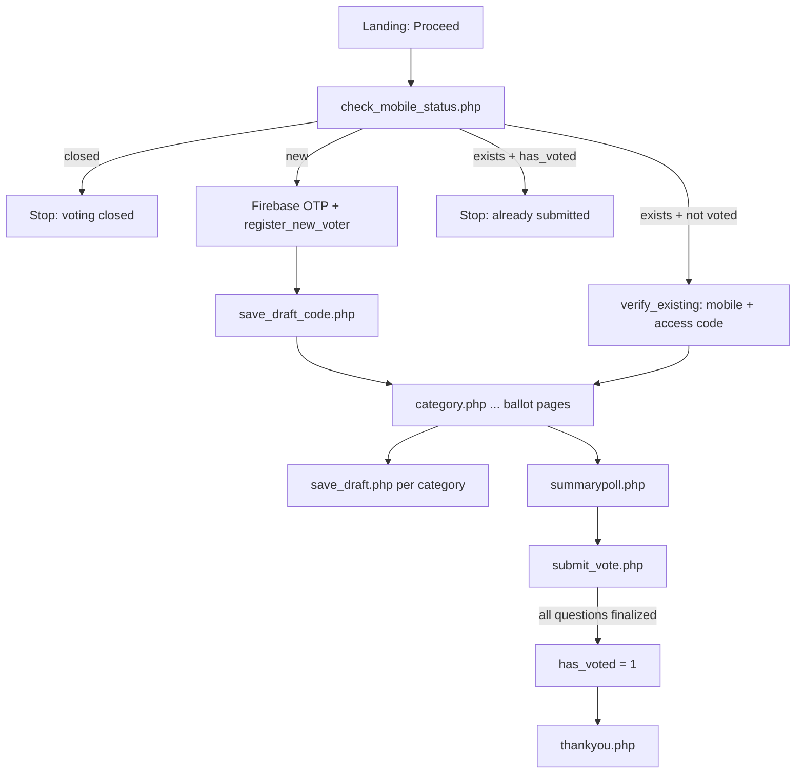

# TOCCA voter flow (logic reference)

This document describes the **canonical** voting flow enforced in `lib/voter_flow.php`. UI copy on `index.php` may list steps in a different order; the **server** always follows this sequence.

## Voter states

| State | Meaning | Next action |
|-------|---------|-------------|
| `NEW` | Mobile not in `tbl_voters` | Firebase OTP → `register_new_voter.php` → set 4-digit access code |
| `REGISTERED` | In `tbl_voters`, `has_voted = 0`, has `draft_code` | `verify_existing.php` (mobile + code) |
| `DRAFTING` | `has_voted = 0`, has draft and/or partial finalized answers | Resume via access code; mutate via session APIs |
| `SUBMITTED` | `has_voted = 1` (all award questions finalized) | No ballot session; read-only thank-you path |
| `CLOSED` | Outside active event `voting_start`–`voting_end` | All gate APIs return `closed` |

`has_data` (gate API) is true when the voter has any row in `tbl_draft_*` or finalized `tbl_poll_*` for the active event.

## Entry flow (identity first)

## API responsibilities

| Endpoint | Role |
|----------|------|
| `check_mobile_status.php` | Gate lookup: `new` / `exists` / `closed` + flags |
| `send_otp.php` / Firebase | Legacy/debug OTP; same registration rules as gate |
| `register_new_voter.php` | Requires Firebase token (prod); creates session; blocks `exists` / `blocked` |
| `save_draft_code.php` | Persists 4-digit resume code (session + open voting; allowed before code exists) |
| `verify_existing.php` | Access code login; **does not** create session when `has_voted = 1` |
| `check_voter_session.php` | `can_access_ballot` = session + access code + open + not submitted |
| `require_voter_page.php` | Guards `category.php`, `selected-category.php`, `summarypoll.php` |
| `save_draft.php` / `submit_vote.php` | Draft/finalize; deny if closed or submitted |

## Session rules

1. Ballot pages require `$_SESSION['voter_id']`, a saved 4-digit `draft_code`, and `can_access_ballot`.
2. `save_draft.php` and other ballot APIs reject requests until `draft_code` is set (`voter_flow_voter_has_access_code`).
3. Completed voters must not receive a ballot session on login (fixed in `verify_existing.php`).
4. `has_voted = 1` is set only when the voter has a finalized answer for **every** question in the active event (`voter_flow_sync_has_voted_if_complete`). Partial category progress keeps `has_voted = 0`.
5. Client `localStorage` is convenience only; **server session** is authoritative.

## Forgot access code

1. `check_has_draft.php` → must be `has_draft` and not `blocked` (submitted).
2. Firebase OTP → reset code via `save_draft_code.php` (same rules as initial setup).

## QR entry (`qr_vote.php`)

Same identity gates; may deep-link to a category after `verify_existing` or new-voter path. QR does not bypass mobile or access-code rules.

## Intentional product rules (unchanged)

- One complete ballot per mobile: `has_voted = 1` only after all awards/questions are voted, not after a single category.
- Partial progress allowed until all categories are finalized (or user stops mid-draft).
- Manual/freetext entries remain subject to admin eligibility review.
- `Vote All` on summary is a client action that calls `submit_vote.php` with batched answers.
